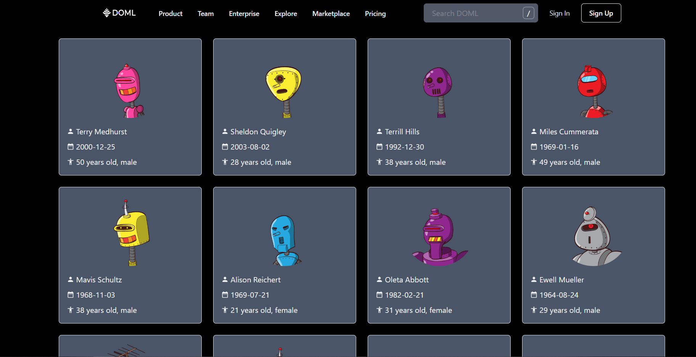

# Assignment

## Setup and run

### Setting up Dev

```shell
git clone https://github.com/anshrusia200/assignment-1.git
cd client
npm install
```

### Running

Inside the client directory run the following command :

```shell
npm run dev
```

The working react app can be viewed on http://localhost:5173

### View Users Page

Click Get Started button on the Landing Page to view the users Cards.

### Screenshots



